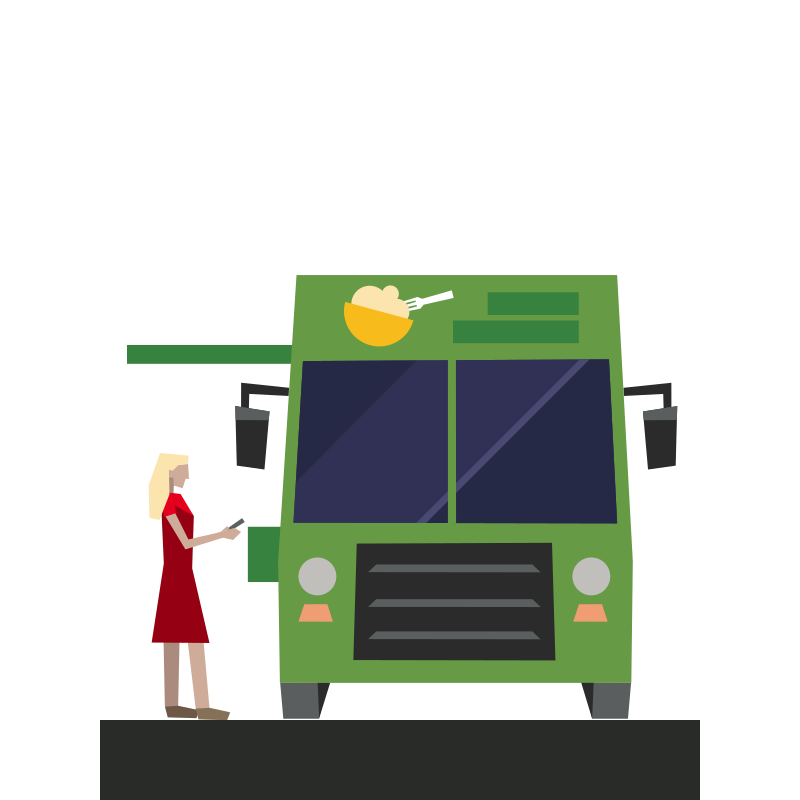

# *hungrèe-estèe*

> Hungrèe manages your food truck habits at Estèe

```js
!! await handleYourAppetite()
```



## Features

- we'll keep you safe by only returning approved vendors, with well defined locations and food categories
- we'll let you know the distance between you and your target truck!
- we'll drop pins on the street map to let you know where your truck is located!
- we'll provide some data driven views about selected vendors and the foods they offer!

## Prerequisites

- **docker & docker-compose**

## Get Started

```sh
git clone https://github.com/apsamuel/engineering-assessment.git
cd engineering-assessment
docker-compose build
docker-compose up -d
```

## Details

After following the steps in [Get Started](#get-started) you will have three entrypoints available to food truck heaven.

- [Hungrèe UI](http://localhost:3001)
  - use a web browser to navigate to the UI
- [Hungrèe API](http://localhost:3000)
  - use a web browser or command line client to interact with the API
- [Hungrèe CLI](./docs/CLI.md)
  - use `docker-compose` to run the hungree-cli script
  - `docker-compose run -it hungree-cli search -c fruit -d 1000000`
  - NOTE: this container is intended to be built and used transiently, it is not a service

## Tips

- Are you playing with this tool and not in the San Franciso Metropolitan area? No sweat, we got you covered,

## To Dos

I have wrapped up most of the MVP blockers in. Anything else is just me being super interested and obsessive 😀 [TODOs](./docs/TODOS.md)

## TLDR

[tldr](./docs/TLDR.md)
