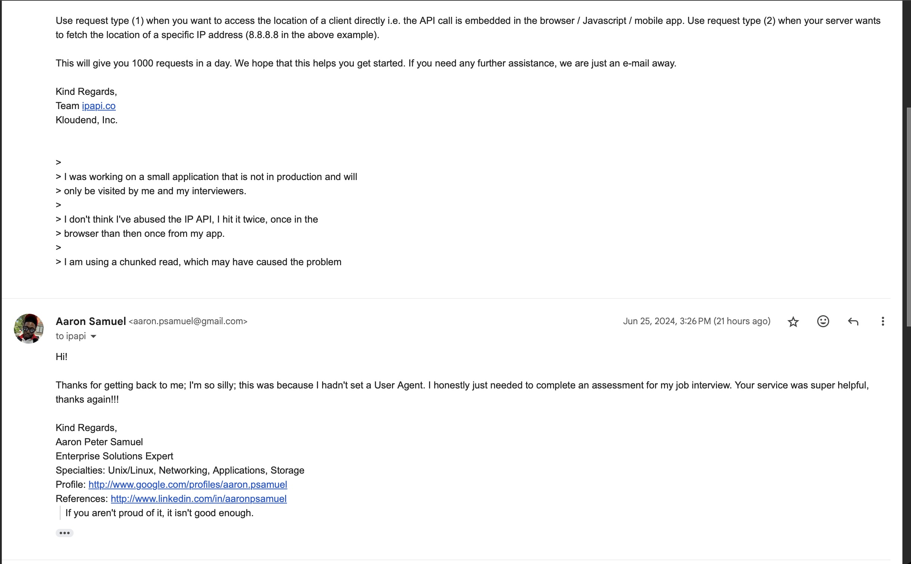

# Process

## Plan

- I read the requirements of the challenge
- I inspected the data source
  - what **`questions can be answered`** with the available data
  - how we can **`add value`** to the existing API
- I thought about how this may eventually be packaged and delivered (containers)

## Brainstorm

- *Searchability*
  - (search by food category, vendor, or nearest distance)
- *Maps & Visualization*
  - I need to look into what's available, hopefully something that's free
- *Preferences & Favorites*
  - I want to avoid creating users, but perhaps we can leverage session cookies to store preferences
    - we can use the rating component in MUI, this will need to be coded appropriately
  - I checked a few yelp reviews for these trucks, and they exist!
    - this implies we know how to search yelp, parse the interesting data, and render it in app somehow. 🤨
      - i would need to tokenize the truck name to a string which is lowercased, has spaces replaced by '-' and stripped of non alphanumeric characters, and append 'san-francisco'
      - Philz Coffee Truck reviews can be found in yelp as [Philz Coffee Truck](https://www.yelp.com/biz/philz-coffee-truck-san-francisco)

- Use existing libraries to accelerate the development of APIs, UIs and CLIs.
  - **API** => `express` for quickly defining an API
  - **UI** => using the `vite` framework to create a `react` project. Using `MaterialUI` for component framework.
  - **CLI** => `commander` for accelerating CLI development

## Develop

- I created a **very** simple API for the data source
  - I wanted to have control over representation of the data
    - I want to use my own simpified searching/sorting/mapping algorithms
- I scaffolded a new vite react project and started to define primary components
  - Data component took/taking the most time, mainly as a result of how to present the data with pagination
  - Focusing on visualizing the data, and I want to add something useful
    - distance!
    - I'm also filtering this data to ensure vendors are approved and have some basic properties set (such as coordinates)
- i used the `./scripts` folder and files as a scratch area, but this became the backbone of the CLI

## Operate

Once I had enough of the assesment working locally, I began working on containerization, first defining the Dockerfiles, and then creating a docker-compose file to orchestrate the total project.

I wanted to run the CLI container persistently, but ran into some issues that may be related to the ENTRYPOINT/CMD or base container configuration. I decided it's not totally neccesary, and documented the steps to using the containerized CLI tool.

## TLDR^2

### A Fun Exchange

While looking into methods for retrieving a users location in a CLI session, I had a brief interaction with the folks at ipapi. I've experienced this before but totally lost why the API wouldn't respond outside a browser, ofcourse, I had not sent a user agent string with the request.

## Notes about items on TODOs

- centralizing core filters/mappings
  - this also was not as bad as it seems, I keep the data pretty raw when fetching, and transform it as needed. this allows me to easily add new functionality as I think of how to leverage various data properties
- About DataGrid
  - The Material UI `DataGrid` component seems to perform horribly in both chrome & safari, and is pretty buggy
    - I am using the community version, there are 2 paid variants I haven't tried
    - After coding up the `Form` component interface and linking reactivity to the `Data` components display, updates or data refreshes render atop each other.
      - more specifically, page 0 is always displayed under any refreshed data!
        - I have a clue as to why, any it is related to the inner workings of the react component. An event is overfiring, or some state is not being correctly managed.
          - This may be a result of how the data set is presented. On mount, we fetch the full list of trucks and work with that data. I may need to review more carefully how I am handling/filtering the data in the component
        - I initially thought this was a pagination issue, but it is an issue with how the DataGrid refreshes
        - I may explore a different component to display data, but I'll spend some more time looking at this first, I really think a DataGrid provides the perfect "home" view
          - interesting, with theme toggling enabled, this improves some, but not much, will loop back around.
        - resolved. I was using react-router-doms browser router, and had specified the `<App>` component twice. Removing the duplicate entry fixed everything.
- About category refactor
  - this is actually not that bad, spacing could be improved, and the initial parsing of categories needs some work.
    - various edge cases in the data make the simple regex/splitting fail silently, leaving long sentences for categories where simple words are expected (hamburgers, mexican food, lobster rolls, etc.)
